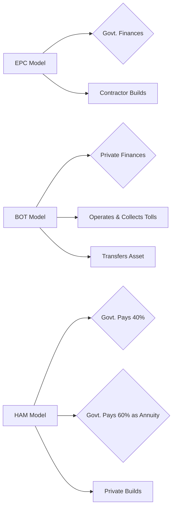

# Types of Project Delivery Models in Infrastructure

## 1. Introduction

Infrastructure development is foundational to economic growth and national development. Roads, bridges, power plants, airports, and water systems are developed through various project delivery models that define how projects are financed, constructed, and operated.

Choosing the right model ensures timely completion, budget efficiency, risk management, and quality assurance.

### Who This Guide Is For:
- Civil and infrastructure engineers  
- Government agencies and policymakers  
- Private sector investors and developers  
- Students and researchers in infrastructure planning  
- Project managers and consultants  

---

## 2. Key Terminology

- **Project Delivery Model**: Contractual arrangement defining responsibilities between parties in infrastructure delivery.  
- **Public-Private Partnership (PPP)**: Collaboration between public and private sectors to finance and operate a project.  
- **EPC (Engineering, Procurement, Construction)**: Contractor handles all design, procurement, and construction tasks.  
- **BOT (Build-Operate-Transfer)**: Private entity builds, operates, and transfers the asset to public authority.  
- **DBFOT (Design-Build-Finance-Operate-Transfer)**: Private party designs, builds, finances, operates, and transfers the asset.  
- **BOOT (Build-Own-Operate-Transfer)**: Private entity owns and operates the asset during the concession.  
- **HAM (Hybrid Annuity Model)**: Government pays 40% upfront, rest via annuities over time.  

---

## 3. Technical Overview

### Major Types of Project Delivery Models

| Model        | Description                                                  | Financing           | Risk Sharing               |
|--------------|--------------------------------------------------------------|----------------------|----------------------------|
| EPC          | Contractor delivers fully built asset with govt. funds       | 100% by government   | Low private risk           |
| PPP          | Public-private collaboration (BOT, DBFOT, etc.)              | Shared               | Balanced                   |
| BOT (Toll)   | Private builds and recovers via tolls                        | Private              | Revenue risk with private  |
| BOT (Annuity)| Private builds and receives fixed government annuity         | Private              | Low revenue risk           |
| DBFOT        | Private designs, builds, finances, operates, transfers       | Private + VGF        | High private risk          |
| BOOT         | Private owns and operates the asset temporarily              | Private              | High private risk          |
| HAM          | Govt. pays 40% upfront, rest via annuity over time           | Shared               | Revenue risk with govt     |

### Visual Overview (Mermaid Diagram)

## 4. Step-by-Step Guide or Workflow

### How to Choose a Delivery Model

#### Assess Project Size & Scope
- **Small govt.-funded projects** → *EPC*  
- **Large national highways** → *PPP, BOT, HAM*

#### Evaluate Revenue Potential
- If tolls are viable → *BOT (Toll)*  
- If not → *BOT (Annuity)* or *HAM*

#### Determine Risk Appetite
- High risk → Private prefers *HAM* or *EPC*  
- Govt. can retain risk using *Viability Gap Funding (VGF)*

### Model Selection Examples

| Project Type            | Suggested Model  |
|-------------------------|------------------|
| Highway with high traffic | BOT (Toll)       |
| Rural road               | HAM              |
| Water treatment plant    | BOOT             |
| Metro systems            | EPC or DBFOT     |

---

## 5. Best Practices

- Conduct thorough **feasibility studies** before selecting a model  
- **Align incentives** between public objectives and private ROI  
- Ensure **transparent bidding and selection** processes  
- Include **dispute resolution** mechanisms in contracts  
- Perform **regular audits and performance monitoring**  

---

## 6. Common Issues & Troubleshooting

| Issue               | Description                            | Solution                             |
|---------------------|----------------------------------------|--------------------------------------|
| Poor risk allocation| Private bears excessive risk           | Redesign contract for better balance |
| Approval delays     | Bureaucracy slows down execution       | Streamline with single-window system |
| Financing hurdles   | Private party can't raise capital      | Provide guarantees or VGF            |
| Toll issues         | Low usage or evasion reduces revenue   | Implement electronic tolling         |

---

## 7. References

- **NITI Aayog PPP Guidelines**  
- **World Bank – Infrastructure Delivery Models**  
- **Ministry of Road Transport and Highways (MoRTH)**  
- **Indian Infrastructure Reports** *(IDFC Institute, ICRA)*  
- **PPPIRC – Public-Private Partnership Resource Center**  

---

## 8. Appendix

### Summary Comparison Table

| Model         | Funding Source     | O&M Responsibility | Revenue Source        |
|---------------|--------------------|---------------------|------------------------|
| EPC           | 100% Government    | Government           | Not Applicable         |
| BOT (Toll)    | Private            | Private              | Toll Collection        |
| BOT (Annuity) | Private            | Private              | Govt. Annuity          |
| DBFOT         | Private            | Private              | Toll or Annuity        |
| BOOT          | Private            | Private              | Operated by Owner      |
| HAM           | Shared             | Private              | Govt. Annuity          |

### Sample Risk Allocation Matrix

| Risk Type            | Government       | Private Developer |
|----------------------|------------------|-------------------|
| Land Acquisition     | ✅               | ❌                |
| Construction Delays  | ❌               | ✅                |
| Revenue Risk         | ✅ *(HAM, BOT-Annuity)* | ✅ *(BOT-Toll)*   |
| O&M Performance      | ❌               | ✅                |
